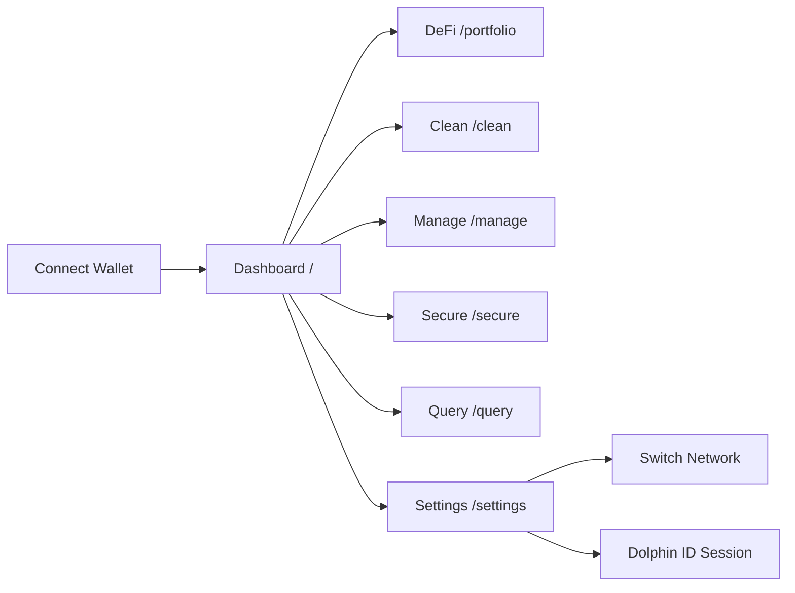
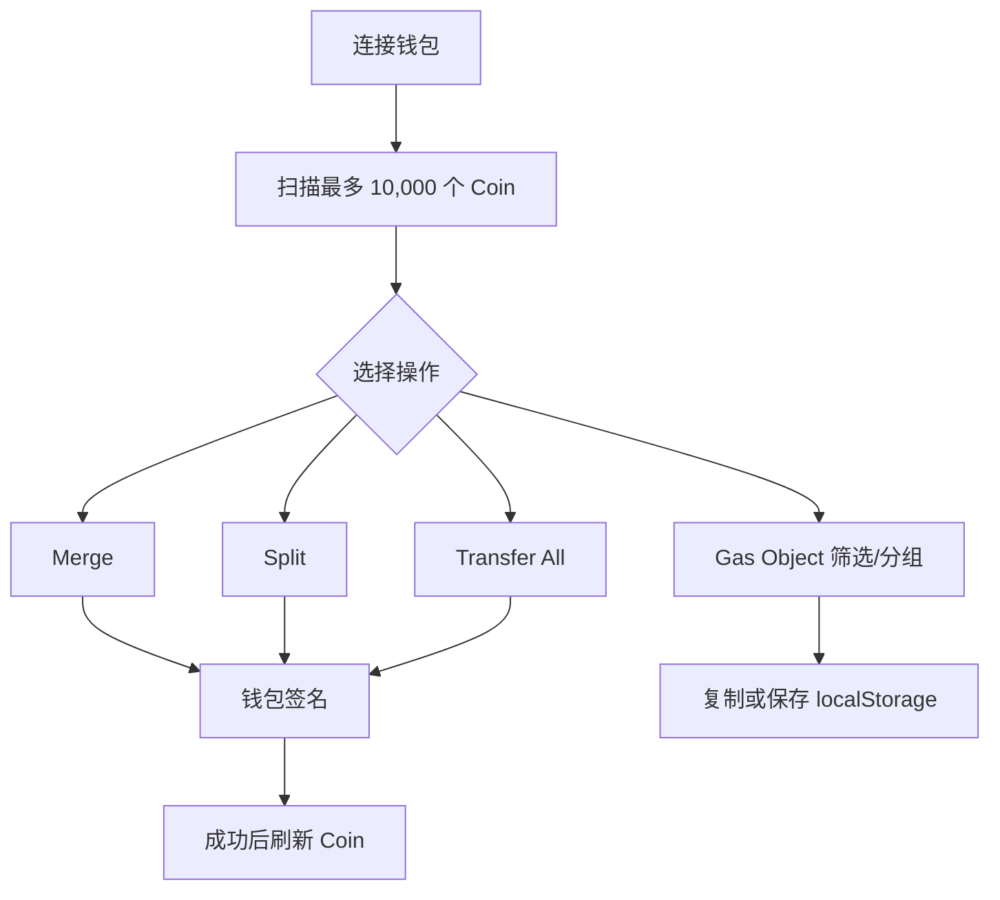
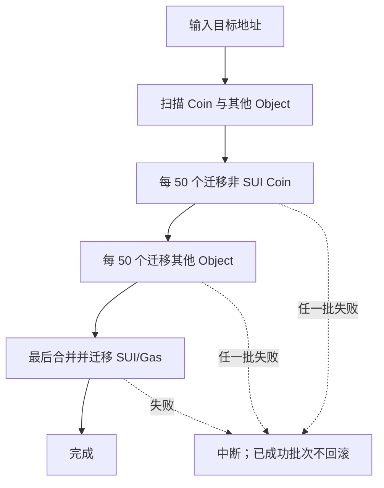
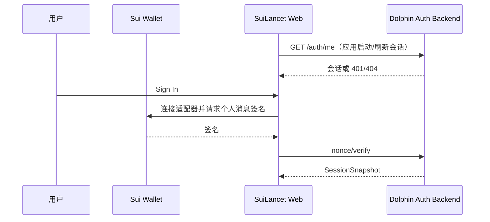

# 页面与流程关系

## 1. 全局导航

所有页面共享顶部钱包与 Dolphin ID 状态。侧边栏是页面之间唯一的内置导航；业务结果中的 Object ID 和交易摘要通常不是页面内链接。

## 2. 状态变化传播

| 来源 | 变化 | 影响页面 |
|---|---|---|
| 顶部钱包按钮 | 连接/切换/断开账户 | Dashboard、DeFi、Clean、Manage、Secure、Query 的数据上下文 |
| Settings | 切换网络 | 后续所有 gRPC 查询与交易；Dashboard Query Key 会随网络变化 |
| Clean | 合并/拆分/转移成功 | Clean 自动刷新 Coin 列表；Dashboard/DeFi 不主动刷新 |
| Manage | 批量转移成功 | 当前页不重新列资产；Dashboard/Clean 不主动刷新 |
| Secure | 交易执行成功 | 清空本页输入与模拟结果；其他页面不主动刷新 |
| Dolphin ID | 登录/登出/恢复 | 顶部按钮与 Settings 状态同步 |
| Gas 分组 | 保存/删除 | 仅 Clean 页；持久化到当前浏览器 localStorage |

## 3. 关键业务流程

### Coin 整理

### Web 钱包迁移

### Dolphin ID

## 4. 页面间缺失联动

- Query 查到的 Object 不能一键带入 Manage 转移。
- Query 查到的交易不能一键带入 Secure 模拟；模拟需要 Base64 TransactionData，不是 digest。
- DeFi 卡片不能跳转到协议、区块浏览器或 Object Inspector。
- Dashboard Token 不能跳转到 Clean 的对应 Coin Type。
- 写操作完成后，其他页面的缓存不会统一失效。
